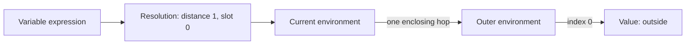

# From Names to Slots: Faster Local Variables in a Tree-Walk Interpreter

A straightforward interpreter usually stores variables in a hash map:

```rust
HashMap<String, Value>
```

When the program evaluates `print total;`, the interpreter searches the current environment for `"total"`. If the name is absent, it follows the enclosing environment and tries again. This representation is easy to understand and works well while building the first version of a language.

Once a resolver has already determined where every local variable lives, however, repeating a name-based search at runtime becomes unnecessary. The resolver can assign each local binding an integer slot and describe every variable access using two numbers:

- **Distance**: how many environments to walk outward.
- **Slot**: which position to access inside the selected environment.

A local variable lookup then becomes an environment-chain traversal followed by direct array indexing.

## The original name-based model

Consider this Lox program:

```lox
{
  var first = "one";
  var second = "two";
  print second;
}
```

A map-based environment might contain:

```text
{
  "first":  "one",
  "second": "two"
}
```

Evaluating `second` requires hashing the string and comparing keys. For nested scopes, the interpreter may repeat that operation in several environments before finding the declaration.

This work is useful when the interpreter does not know where the variable was declared. It is redundant after static resolution.

## Assigning slots during resolution

The resolver already visits declarations in lexical order. It can assign an index when each local is declared:

```text
first  -> slot 0
second -> slot 1
```

The scope can still use a hash map while resolving names:

```rust
struct Local {
    defined: bool,
    used: bool,
    slot: usize,
}
```

The hash map is useful during analysis because source programs refer to variables by name. Its job is to translate a name into static metadata. At runtime, the interpreter no longer needs that name for a successfully resolved local access.

For the `second` expression, the resolver records something equivalent to:

```text
expression ID -> { distance: 0, slot: 1 }
```

The expression ID identifies the particular AST occurrence. This is important because separate expressions containing the same variable name may resolve to different declarations.

## Distance and slot are different dimensions

The slot alone is insufficient when scopes are nested:

```lox
{
  var outer = "outside";

  {
    var inner = "inside";
    print outer;
    print inner;
  }
}
```

Both `outer` and `inner` may occupy slot `0`, but in different environments:

```text
outer access -> distance 1, slot 0
inner access -> distance 0, slot 0
```

Slots are unique within a scope, not across the entire program. Reusing slot numbers in separate environments keeps each environment compact.



## Runtime environments become arrays

Each local environment stores values in declaration order:

```rust
Vec<Option<Value>>
```

For the earlier example, the runtime representation is conceptually:

```text
slot 0 -> "one"
slot 1 -> "two"
```

`Option<Value>` preserves the distinction between an initialized variable and a declared variable that currently has no value. It allows the interpreter to retain errors such as reading an uninitialized local.

Reading a resolved variable performs three operations:

1. Look up the expression's resolution metadata.
2. Walk `distance` links through enclosing environments.
3. Read `local_values[slot]`.

Assignment uses the same location and replaces the value at that slot.

## Why globals remain name-based

Global variables behave differently from lexical locals:

- They may be created across separate REPL submissions.
- Native functions may be registered dynamically.
- An unresolved name must be checked at runtime.
- Lox permits repeated global declarations.

Keeping globals in a `HashMap<String, Value>` preserves those semantics. The optimization applies only when the resolver can prove that an expression refers to a particular local declaration.

This creates a useful hybrid:

```text
resolved local   -> environment distance + array slot
unresolved name  -> global hash map
```

## Declaration order is the central invariant

The resolver and interpreter must agree about scope creation and declaration order.

If the resolver assigns:

```text
parameter a -> slot 0
parameter b -> slot 1
local c     -> slot 2
```

then a function call must populate its environment in exactly that order:

```text
argument for a -> slot 0
argument for b -> slot 1
value of c     -> slot 2
```

The same correspondence applies to blocks. Every resolver scope must match one runtime environment:

- Entering a lexical block begins a resolver scope and creates a runtime environment.
- Entering a function begins a resolver scope and creates a call environment.
- Parameters are inserted before function-body locals in both passes.
- Local declarations append values in the same order in both passes.

This coupling is the main risk of indexed locals. If one pass creates an extra scope or inserts values in a different order, valid indexes can silently refer to the wrong variables.

Assertions around invalid distances and slots are valuable because they turn this synchronization bug into an immediate failure.

## Closures still work

Indexed storage does not change the fundamental closure model. A function still captures a reference-counted environment:

```text
closure -> captured environment -> enclosing environment
```

The captured environment now contains a vector instead of relying on names for local access. Because closures retain the environment object itself, later reads and assignments operate on the same slots.

For example:

```lox
fun makeCounter() {
  var count = 0;

  fun increment() {
    count = count + 1;
    print count;
  }

  return increment;
}
```

The accesses to `count` inside `increment` resolve to the slot in `makeCounter()`'s environment. Each call updates that captured slot, so the state survives after `makeCounter()` returns.

## The late-shadowing case

Static resolution also fixes a subtle closure bug:

```lox
var value = "global";

{
  fun showValue() {
    print value;
  }

  showValue();
  var value = "block";
  showValue();
  print value;
}
```

When `showValue` is resolved, the block-local declaration has not been encountered yet. Its `value` expression therefore resolves as global. Both calls print `"global"`, while the final direct access prints `"block"`.

The runtime does not search dynamically and accidentally discover the later local declaration. Resolution has already fixed the meaning of each expression.

## Performance characteristics

Name-based local lookup has several costs:

- Hashing a variable name.
- Comparing map keys.
- Repeating the lookup in enclosing environments.

Indexed lookup replaces the hash-map operation with array indexing:

```text
Before: walk environments and hash the name at each step
After:  walk a known distance and index one array
```

Walking the enclosing chain is still proportional to lexical depth. More advanced implementations may flatten closure layouts, use displays, or compile local accesses into stack-frame offsets. Distance-and-slot resolution is a useful intermediate design because it significantly reduces lookup work without requiring a bytecode compiler.

## Memory and design trade-offs

Indexed locals add metadata for every resolved expression:

```text
ExprId -> { distance, slot }
```

They also increase coupling between the resolver and interpreter. In exchange, runtime environments avoid storing local names and local access avoids hashing.

The main trade-offs are:

- **Faster local access** at the cost of more resolver metadata.
- **Smaller runtime local environments** at the cost of stricter pass synchronization.
- **Simple global behavior** by retaining a separate name-based global map.
- **Better static semantics** because every local expression has a fixed declaration.

For a tree-walk interpreter, the performance difference may not dominate total execution time. The technique is still valuable because it introduces the same idea used by more advanced language implementations: resolve symbolic names once, then execute using compact locations.

## Testing the invariant

An indexed implementation should include tests for:

1. Multiple locals in the same block.
2. Reads from an enclosing block.
3. Shadowed names occupying slots in different environments.
4. Assignment to local and captured variables.
5. Function parameters followed by local declarations.
6. Recursive local functions.
7. Closures that mutate captured state.
8. Variables declared after a closure is created.
9. Uninitialized local reads.
10. Globals and native functions remaining name-based.

These tests verify more than output. Together, they check that resolution order and runtime environment construction remain synchronized.

## Conclusion

Source code uses names because names are meaningful to people. Runtime execution does not need to keep paying the cost of interpreting those names once semantic analysis has identified each declaration.

By translating local variable expressions into an environment distance and array slot, the resolver turns symbolic references into compact runtime addresses. Globals retain their dynamic name-based behavior, while locals gain predictable and efficient access.

This is a small optimization with a larger lesson: static analysis is not only for reporting errors. It can also precompute decisions that make runtime execution simpler, faster, and more precise.
